<div align="center">
  
</div>

<div align="center">
  <h1>Ratiq Ahamed MR</h1>
  <p><strong>Director of Technology & Business Operations at Ultrakote</strong></p>
  <p>Building software that understands the factory floor.</p>

  <a href="https://www.linkedin.com/in/ratiq-ahamed-mr/">
    
  </a>
</div>

---

### From production floor to production code

I work where **manufacturing, business operations, and intelligent software** meet. At **Ultrakote Printing & Packaging**, I lead technology and business operations while building systems that turn real factory activity into clear, reliable data.

My current focus is an end-to-end manufacturing platform for job planning, production tracking, machine workflows, inventory, costing, quality, reporting, and AI-assisted automation. I care about software that survives contact with the real world: operators, deadlines, machines, waste, and all.

```text
Factory signal  ->  Reliable data  ->  Better decisions  ->  Measurable impact
```

### What I am building

| Area | Work |
|---|---|
| **Smart manufacturing** | Digitizing print and packaging workflows across machines and processes |
| **Production software** | Building a production-grade platform with FastAPI, PostgreSQL, and Next.js |
| **Applied AI** | Integrating ML, automation, and decision support into practical business workflows |
| **Operations** | Connecting technology choices to productivity, traceability, quality, and growth |

### Journey

**Director of Technology & Business Operations · Ultrakote**  
Leading digital transformation, software development, AI integration, and technology-led operational improvement for a manufacturing company.

**Machine Learning Intern · TVS Next**  
Worked in Data & AI with Python, Pandas, NumPy, SciPy, scikit-learn, reinforcement learning, FastAPI, and Django; contributed to applied ML solutions and deployment-oriented engineering.

**Machine Learning Researcher / Intern · ISMO Bio-Photonics**  
Built domain-focused generative AI and customer-support solutions, including a fine-tuned model and a deployable desktop application.

**B.Tech · Artificial Intelligence & Data Science**  
Easwari Engineering College, Chennai.

### Selected work

| Project | What makes it interesting |
|---|---|
| **Ultrakote Manufacturing Platform** | Live job cards, production tracking, process sequencing, plate lifecycle, inventory, costing, and reports |
| **Decathlon Cycle Recommender** | Fine-tuned Llama 3.1 with QLoRA for domain-specific product recommendations |
| **AI Mock Interview** | Interactive interview practice using Next.js, voice AI, and Firebase |
| **Boat Safety Detection** | Custom YOLOv11 vision system for occupancy-based alerts |
| **Wood Texture GAN** | Generative modeling pipeline for producing high-resolution wood textures |

### Technology I use

<div align="center">


</div>

---

<div align="center">
  <strong>I am interested in systems that do more than demo well.</strong><br />
  They should make work clearer, faster, and easier to trust.
</div>
